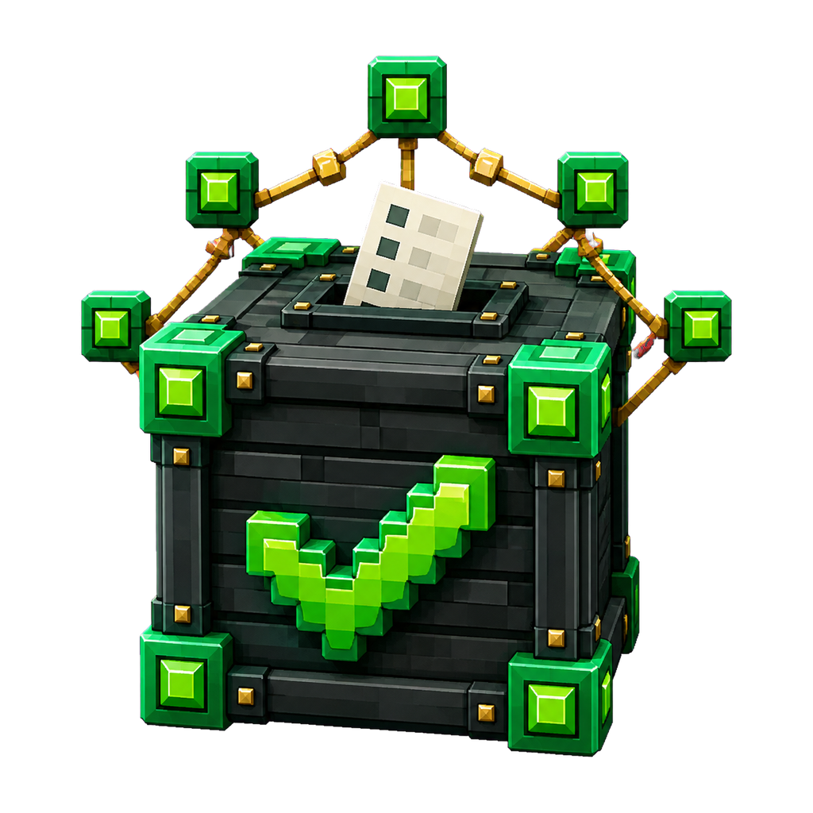

<div align="center">



# JExVote
### All-in-One Vote Rewards & Engagement

Built-in Votifier | Streaks | Streak Freezes | Vote Gifting | Lucky Vote | Vote Party | Vote Shop | Bedrock Forms | REST API | Multi-language

*Supports Votifier v1 (RSA) and NuVotifier v2 (token). No external Votifier plugin required.*

</div>

---

> **Status:** BUILT (free + premium editions). **Last verified:** 2026-09-27. **Related:** [../README.md](../README.md). Built: `jexvote-{api,common,free,premium}` modules with a self-contained Votifier v1/v2 server.

## What is JExVote?

JExVote handles everything around server voting: it receives votes from vote sites with its own built-in
Votifier server, pays rewards, tracks streaks and shows everything in one `/vote` menu. You do not need
NuVotifier. The bundled defaults only use vanilla items and XP, so a fresh install works without any other
plugin.

---

## Setup guide for server owners

1. **Install.** Put the JExVote jar (Free or Premium) into `plugins/` and start the server once. JExVote writes
   `config.yml`, `sites.yml`, `rewards.yml`, the translation files, an RSA key pair (`rsa/`) and a Votifier
   token into `plugins/JExVote/`.
2. **Open the Votifier port.** `votifier.port` in `config.yml` (default `8192`) must be reachable from the
   internet: open it in your firewall or hosting panel. Leave `votifier.host` empty to listen on all
   addresses.
3. **Add your vote sites** in `sites.yml` (the file explains every field and contains a commented example):

   ```yaml
   sites:
     my-list:
       display-name: 'My Server List'
       service-name: 'MyList'          # the name the site sends with each vote, not its web address
       vote-url: 'https://example.com/server/123/vote'
       cooldown-minutes: 1440          # or: daily-reset: '00:00' + timezone: 'UTC'
       points-per-vote: 1
   ```

4. **Connect the sites.** Run `/jexvote key`: it prints the port, the v2 token and the public key (one line and
   PEM, click to copy). Enter them in the Votifier settings of each vote site.
5. **Check the setup.** `/jexvote info` shows whether Votifier is listening, how many sites are loaded, when the
   last vote arrived, which features are on (and why a feature is off: switched off in `config.yml` or Premium
   only) and which economy, PlaceholderAPI and Floodgate hooks were found.
6. **Test.** `/jexvote fakevote <player> [service]` sends a test vote through the whole pipeline. If real votes
   arrive but no site card updates, `/jexvote debug-services` lists the service names that arrived and which
   site each one matches; copy the right one into `service-name`.
7. **Set your rewards** in `rewards.yml` and apply them with `/jexvote reload` (see below).

`/jexvote reload` reloads `config.yml`, `rewards.yml` and `sites.yml` and applies sites (with the edition
limit), rewards, streak settings, the weekend bonus, Streak Freezes, the vote party rewards and target, vote
effects and the currency display. The Votifier port, the database and starting or stopping the vote party
need a restart.

---

## Free and Premium

| | Free | Premium |
|---|---|---|
| Vote sites | first 5 in `sites.yml` (a console warning and `/jexvote info` say when sites were skipped) | unlimited |
| Rewards, streaks, Streak Freezes, gifts, Lucky Vote, top voters, Bedrock forms, PlaceholderAPI | yes | yes |
| Vote shop (`/vote shop`) | no | yes |
| Vote party | no | yes |
| Weekend bonus | no | yes |
| Network sync on a shared database, reward provider API, API write hooks | no | yes |

A feature that is not part of the edition is hidden from `/vote`, `/vote help` and the Bedrock forms, and
`/jexvote info` marks it as "Premium edition only".

---

## Rewards (`rewards.yml`)

| Section | Paid when |
|---|---|
| `default-rewards` | every vote on any site |
| `guaranteed-rewards` | every vote, on top of the defaults; named in the "Every vote also pays" chat line |
| `streak-rewards` | once, when the best streak reaches the day number (claimed in the streak menu with `streak.claim-mode: manual`, paid on the day with `auto`) |
| `site-rewards` | a vote on one site, keyed by the site id from `sites.yml` (the service name works too) |
| `vote-party-rewards` / `vote-party-pool` | when a vote party completes (Premium) |
| `vote-shop` | bought with vote points in `/vote shop` (Premium) |

Reward types: `item`, `xp`, `currency`, `command`, `permission`, `sound`, `particle`, `title`, `teleport`,
`composite`, `choice`, `custom`, plus JExVote's `chance` and `lucky` (weighted pool). The end of `rewards.yml`
has an example of each. Command rewards run with `asConsole: true` and support `{player}`, `{uuid}`,
`{world}`, `{x}`, `{y}`, `{z}`; give them a `describe:` text so the menus can name them.

- **Currency rewards** pay through JExEconomy, or through Vault when JExEconomy is not installed.
  `/jexvote info` shows which one is used; without either, currency rewards pay nothing.
- **Currency display:** `display.currency-style` in `config.yml`. `auto` shows the coin / crystal icons only
  when JExEconomy is installed and plain names ("500 Coins") otherwise. Rename a currency with
  `display.currency-names`.
- JExVote never adds bundled rewards back into your `rewards.yml`: a reward you delete stays deleted.

---

## Menus

All menus share one layout: back at the top left, the header card in the top middle, the Filter button
(hopper minecart) at the top right, the content in the middle (centred when there are only a few cards), page
arrows at the bottom middle and Close at the bottom left. Cards start with one sentence that says what they
are, then `Label | value` rows under short section titles and at most one action line. All text comes from
`translations/<locale>.yml`.

- **Vote menu** (`/vote`), top to bottom:
  - header: how voting works, how many sites are ready now, the weekend bonus and vote party progress when
    they are on;
  - your stats: your votes (all time, this month, last vote, rank), your vote points (click to open the shop)
    and your streak (current, best, next milestone with a bar, Streak Freezes; click for the streak rewards);
  - one card per vote site: ready (green) or on cooldown (clock, with the time left), the vote points it pays
    and any extra rewards of that site. Click for a clickable vote link in chat;
  - one row of navigation: Streak rewards, Vote rewards, Top voters, Vote shop, Vote party. Cards of features
    that are off are left out.
- **Streak rewards:** header with current and best streak, next milestone and how many milestones are ready to
  claim; one card per milestone (claimed, ready, paid out, next, locked). Left-click a ready milestone to claim
  it, right-click for a page with every reward of that day. Filter: all, ready to claim (manual claim mode
  only), reached, not reached yet.
- **Vote rewards** (`/vote rewards`): wallet header (vote points, Streak Freezes, gifts left) and cards for
  what every vote pays, Lucky Vote (click for every prize with its real chance), the weekend bonus, Streak
  Freezes (click to buy) and vote gifts.
- **Top voters** (`/vote top`): top 50 as player heads; the filter switches between all time and this month,
  the header shows your own place.
- **Vote shop** (Premium): balance header, filter (everything, can buy now, crate keys, items, other) and one
  card per item with what it gives and the price.
- **Vote party** (Premium): progress, what every voter gets and the prize pool with chances.

Bedrock players (Floodgate) get the same content as forms: vote menu, streaks with claim buttons, rewards,
lucky prizes, top voters (all time / this month), shop with a confirmation step and the vote party.

---

## Commands and permissions

**Players** (`/vote`, alias `/v`, permission `jexvote.command.vote`, given to everyone by default)

```
/vote                    Open the vote menu
/vote sites              List every vote site with a clickable link
/vote stats [player]     Vote stats; without a player it opens the menu
/vote top [count]        Top voters (menu, or a chat list when the menu is off)
/vote rewards            What a vote pays and what vote points do
/vote shop               Vote shop (Premium)
/vote freeze             Buy a Streak Freeze with vote points
/vote gift <player|random>   Keep a friend's streak alive
/vote help               Command list (only shows commands of features that are on)
```

**Staff** (`/jexvote`, alias `/jv`)

```
/jexvote info            Server status: Votifier, sites, last vote, features, integrations
/jexvote key             Votifier port, v2 token and public key for the vote sites
/jexvote debug-services  Which service names arrived and which site they match
/jexvote fakevote <player> [service]   Send a test vote
/jexvote reload          Reload config.yml, rewards.yml and sites.yml
/jexvote setstreak <player> <value>    Set a player's streak
/jexvote reset <player>  Reset a player's vote stats
/jexvote resetmonthly    Reset everyone's monthly votes
```

| Permission | Allows |
|---|---|
| `jexvote.command.vote` | `/vote` and its subcommands (default: everyone) |
| `jexvote.command.admin` | `/jexvote`, `info`, `key`, `debug-services`, `help` |
| `jexvote.command.admin.reload` | `/jexvote reload` |
| `jexvote.command.admin.reset` | `/jexvote reset` and `resetmonthly` |
| `jexvote.command.admin.fakevote` | `/jexvote fakevote` |
| `jexvote.command.admin.setstreak` | `/jexvote setstreak` |
| `jexvote.freeze.max.<n>` | own up to `<n>` Streak Freezes (highest wins) |
| `jexvote.gift.daily.<n>` | send up to `<n>` gifts per day (highest wins) |

Command names, aliases and permissions can be changed in `plugins/JExVote/commands/vote.yml` and
`commands/jexvote.yml`.

---

## Placeholders (PlaceholderAPI)

| Placeholder | Value |
|---|---|
| `%jexvote_total%` | all-time votes |
| `%jexvote_monthly%` | votes this month |
| `%jexvote_streak%` | current streak |
| `%jexvote_highest_streak%` | best streak |
| `%jexvote_points%` | vote points |
| `%jexvote_last_vote%` | date of the last vote |
| `%jexvote_player_name%` | stored player name |
| `%jexvote_party_current%` / `%jexvote_party_target%` / `%jexvote_party_remaining%` | vote party progress (0 without a party) |
| `%jexvote_reward_count_<id>%` | how often the chance / lucky prize with that `id` was won |

Player values are cached for a short time, so they can lag a vote by a few seconds.

---

## Streaks, freezes and gifts

- A streak counts days in a row with a vote. It breaks after `streak.timeout-hours` (default 36) without a
  vote.
- **Streak Freezes** save a streak automatically when a day is missed. Every player gets `free-amount` once;
  more cost `cost-points` vote points each, up to `default-max` (or `jexvote.freeze.max.<n>`).
- **Vote gifts:** `/vote gift <player>` moves only the receiver's streak forward by one day. Limit per day:
  `vote-gift.daily-limit` (or `jexvote.gift.daily.<n>`); with `require-vote-today` the gifter must have voted
  that day.
- Milestones count from the best streak, so reached milestones stay claimable after a streak breaks.

---

## Votifier protocol

- **Votifier v1:** RSA-encrypted vote block, key pair in `plugins/JExVote/rsa/`.
- **NuVotifier v2:** JSON payload signed with the token from `votifier.token`.

The protocol is detected per connection. `/jexvote key` prints everything a vote site needs.

---

## Languages

English (`en_US`) and German (`de_DE`) cover every message and menu. Czech (`cs_CZ`) and Slovak (`sk_SK`)
cover part of the chat and command texts; everything else falls back to English. Each player sees their client
language. Translation files are written to `plugins/JExVote/translations/` once; after an update, keys that are
new in the plugin are added automatically, but texts you already have are not overwritten.

---

## Dependencies

**Required:** Paper 1.21+ (Folia supported), Java 25.

**Optional:** JExEconomy or Vault (currency rewards), LuckPerms (permission rewards), PlaceholderAPI
(placeholders), Floodgate (Bedrock forms).

---

## Changelog

- 2026-09-27: vote menu reorganised into header, stat row, site cards and one navigation row (with the vote
  party); centred layouts in every menu; features that are off or Premium only are hidden everywhere;
  `/jexvote info` status panel; generic first-run `config.yml`, `sites.yml` and `rewards.yml`; currency icons
  only with JExEconomy; `site-rewards` by site id; vote effects and reload of party rewards, target and effects
  now work; Free site limit also applies on reload.
- 2026-09-26: menus, lore and messages rebuilt on the suite design rules.
- 2026-09-17: doc-quality pass (status banner + cross-links).
